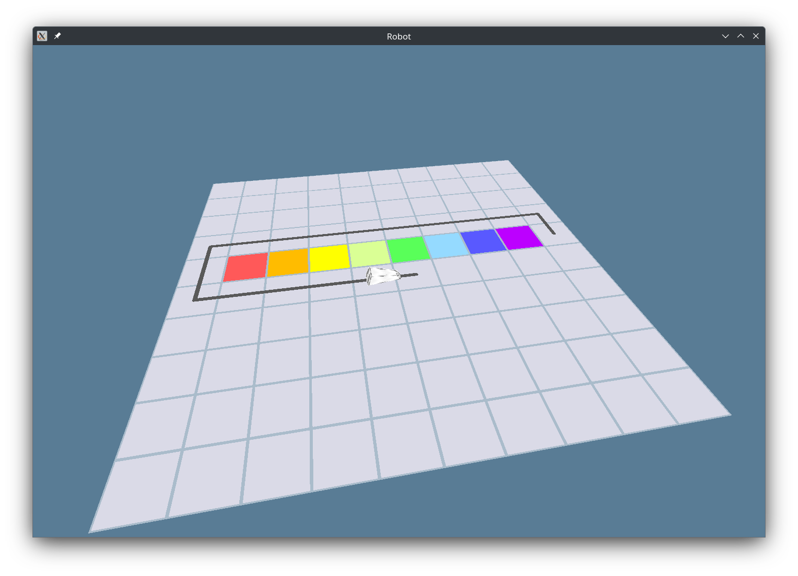

# Gam3du

> [!NOTE]
> 🇺🇸/🇬🇧 [English version of this document](README.md)  
> Bitte beachte die [Besonderheiten der Deutschen Fassung](#zu-dieser-übersetzung) in diesem Projekt

_Gam3du_ ist eine Spiele-Engine die für Lehrzwecke entwickelt wird. Die Hauptziele sind das Lernen/Unterrichten von Software-Entwicklung, Einfachheit und vor allem Spaß!

> Am Anfang war `0x00`.

Das Projekt befindet sich derzeit noch in der Machbarkeitsprüfung (_psst … es sieht gut aus soweit_), in der wir sehen wollen ob das was wir vorhaben überhaupt sinnvoll möglich ist. Das nächste Ziel ist ein MVP ([minimum viable product](https://de.wikipedia.org/wiki/Minimum_Viable_Product)), den man schon nutzen kann um einfache Programmieraufgaben in der Programmiersprache Python stellen zu können.

## Motivation

Wenn du Lieschen Müller fragst wie viele Computer sie besitzt, wird sie vermutlich irgendwas zwischen "keinen" und "drei" antworten. Wenn du sie dann darauf aufmerksam machst, dass alles mit einem Bildschirm ebenfalls einen Computer beinhaltet, werden ihr sicher noch ein paar zusätzliche Smartphones, Smartwatches, Tablets und Fernseher einfallen.

Die Wahrheit ist: Lieschen besitzt vermutlich wesentlich mehr Computer als Lampen (wobei wir die Computer in den Lampen noch gar nicht mitgezählt haben). Computer sind überall: TV-Fernbedienung, Kaffeemaschine, Autoradio, Taschenrechner, Bluetooth Freisprecheinrichtung, Türklingel, Kamera, elektrische Zahnbürste, Drucker, Waschmaschine, … oder als einfache Daumenregel: Wenn etwas Strom braucht, steckt heutzutage vermutlich ein Computer drin. Irgendjemand muss den ganzen kleinen Helfern aber erklären was sie tun sollen, wenn jemand einen Knopf drückt, der Akkus fast leer ist oder die WLAN-Verbindung abbricht.

Dieser _Jemand_ ist ein _Software-Entwickler_ - umgangssprachlich auch oft _Programmierer_ genannt. Da Entwickler nicht einfach an [Bäumen](https://de.wikipedia.org/wiki/Baum_(Datenstruktur)) wachsen, müssen wir auf eine traditionelle Methode zurückgreifen: _Ausbildung_. Auch wenn dass erst mal ernüchternd klingt, kann [ich](https://github.com/kawogi) aus eigener Erfahrung sagen, dass sich beinahe alle guten Entwickler von Technologiethemen im allgemeinen angezogen fühlen: Gib ihnen etwas Interessantes zum Spielen und sie geben dir etwas Beeindruckendes zurück!

Heutzutage beginnt der Informatikunterricht schon in der fünften Klasse bei den 10-Jährigen Schülern (zumindest in Deutschland). Einen super Einstieg bietet [Scratch](https://scratch.mit.edu/). Scratch ermöglicht es kleine Spiele und Animationen zu erstellen, indem man in einer grafischen Oberfläche Befehlsblöcke kombiniert. Andere Plattformen wie [Jugendwettbewerb Informatik](https://jwinf.de/) bieten eine Reihe an Programmieraufgaben unterschiedlicher Schwierigkeit, die man sowohl grafisch (wie in _Scratch_) oder mit der _Python_-Programmiersprache lösen kann. Das ist eine tolle Möglichkeit auf eine textbasierte Programmiersprache zu wechseln, welche auch in der Praxis genutzt wird.

Ok, die sechste Klasse ist geschafft. Du hast gemerkt, dass Programmieren etwas für dich ist und deine Englisch-Fähigkeiten reichen aus, um dir die paar Keywords zu merken die man für eine echte Programmiersprache braucht. Aber was nun?

Der übliche Ansatz ist es Opas Computer zu entstauben und die Grundlagen der Programmierung anhand von Beispielen Schritt für Schritt zu erwerben. Eine halbe Stunde lang zu versuchen den eigenen Code mit Versuch und Irrtum dazu zu bringen das erhoffte Ergebnis `42` auszugeben ist nicht jedermanns Verständnis von "Spaß mit dem Computer".

Wäre es nicht schöner, wenn man dort weiter machen könnte wo man aufgehört hat? Mit Scratch oder der Schildkröte, die Linien zeichnen konnte hattest du doch schon so etwas wie ein Spiel, das   du mit deinem Programm steuern konntest. Könnte man das nicht einfach auf das nächste Level heben? Aber wie?

Das ist genau die Lücke, wie wir füllen möchten.

## Was wir machen

Wir schreiben unsere eigene Spiele-Engine (Game-Engine).

Äh, moment mal … das klingt ganz schön ambitioniert und es gibt ja schon viele Game-Engine da draußen. Warum also noch eine neue entwickeln?

Die meisten Game-Engines haben als Ziel möglichst schnell kommerziell erfolgreiche Spiele entwickeln zu können. Aus diesem Grund ist die Wiederverwendung fertig entwickelter Spielelemente eine wichtiges Merkmal. Jedes mal das Rad (oder Schiene, Jet-Pack, Teleporter, …) neu zu erfinden würde nur den Release-Termin unnötig nach hinten schieben. Durch den kommerziellen Fokus sind viele dieser Engines auch kostenpflichtig und für Schulen und Schüler nicht immer bezahlbar. Ein weiterer Grund ist, dass die Engines oft _Closed Source_ sind. Wenn man sich also nicht damit begnügt den x-ten Klon eines Platformers, Shooters oder Knobelspiels zu entwickeln sondern sich für die tiefer gehenden Details interessiert, dann muss man sich woanders umsehen.

Ein anderer Grund eine eigene Game-Engine zu entwickeln: es ist herausfordernd. In anderen Worten: Spaß!

_Gam3du_ wird nicht die schnellste Game-Engine am Markt sein. Außerdem wird sie nicht die vielseitigste werden oder grafisch besonders beeindruckend. Was bleibt übrig? _Gam3du_ soll folgende Eigenschaften haben:

- _Zugänglichkeit_ - Es soll immer möglich sein "einfach drauflos zu coden". Keine unnötig komplizierten Installationsprozeduren, Build-Scripte, Systemabhängigkeiten, Paketmanager, …
- _Einfachheit_ - Wir stellen Lesbarkeit über komplexe Lösungen. Es gilt aber auch die richtige Balance zu finden, wenn es um den Ressourcenverbrauch geht.
- _Erweiterbarkeit_ - Die Engine stellt nur die Grundelemente zur Spieleentwicklung zur Verfügung. Alles andere werden Mods, die von der Community bereitgestellt werden!
- _Robustheit_ - Die Engine muss mit User-Code umgehen können, der nicht immer _ganz so optimal wie möglich_ ist. Es ist unsere Aufgabe dafür zu sorgen, dass dann nicht alles außer Kontrolle gerät.
- _Hilfreich_ - Fehler gehören dazu und wenn sie passieren, verdient ihr eine gute Erklärung was schiefgegangen ist. Logs und Fehlermeldungen mit genug Kontext sollen euch dann unterstützen.

## Zielgruppen

> Wie viele Personen braucht man um [dem Spiel eine Tür hinzuzufügen](https://lizengland.com/blog/2014/04/the-door-problem/)?

_Gam3du_ soll für eine Vielzahl an Lehr- und kreativen Zwecken geeignet sein:

- Unterrichten: Lehrer können diese Plattform nutzen um ihren Schülern Aufgaben unterschiedlicher Komplexität zu stellen. Es wir eine Auswahl an üblichen Aufgaben geben aber es können auch eigene erstellt und verbreitet werden.
- Spieleprogrammierung mit Skripts: Schüler können die Plattform nutzen um eigene kleine Spiele und Simulationen in einer 3D-Umgebung zu erstellen.
- Kreativ: Die Erstellung von 3D-Modellen, Sounds, Texturen, Shader Programmierung (WGSL), …
- An der Engine selbst arbeiten: Diese Möglichkeit richtet sich an erfahrenere Entwickler die die Möglichkeiten der Plattform erweitern wollen.

## Herausforderungen

### Zeit

Das ist das Hauptproblem, das alle nicht-kommerziellen Projekte plagt: Genug Freiwillige mit den richtigen Fertigkeiten finden, die genug Zeit haben gemeinsam an etwas zu arbeiten. Dieses Projekt dient in erster Linie Lehrzwecken und es ist daher nicht damit zu rechnen, dass sich jemand findet der die investierte Zeit vergütet.

### Sprachbarriere

Momentan befindet sich unser kleines Team fast vollständig in Deutschland. Englisch als Hauptkommunikationssprache ist hierzulande nicht so üblich wie in kleineren Ländern. Wir versuchen daher die wichtigsten Einstiegsdokumente und -aufgaben zu lokalisieren.

## Wie du helfen kannst

Momentan sind wir noch dabei uns zu sortieren. Wir aktualisieren diesen Abschnitt, sobald sich der Staub gelegt hat.

## Wie man das Projekt baut und startet

Allgemeine Installation und Vorbereitung:

1. [Installation der Rust-Toolchain](https://www.rust-lang.org/learn/get-started)
2. `git clone git@github.com:gam3du/gam3du.git` - dieses Repository klonen
3. `cd gam3du` - In das Projektverzeichnis wechseln

Jetzt gibt es zwei Möglichkeiten das Projekt zu starten:

### Nativ auf dem lokalen Computer ausführen

- `cargo robot` - das Programm bauen und starten

Es geht ein neues Fenster auf, in welchem sich ein Python-gesteuerter Roboter über eine Ebene bewegt.

Mit `ESC` beenden oder einfach das Fenster schließen.

### Im Web-Browser laufen lassen

- `cargo robot-web` - baut das Programm und startet einen Web-Service.
- Mit einem `Strg`-Klick auf den angezeigten Link öffnet sich ein Browser.

Im Browser findest du auf der rechten Seite einen Code-Editor und links die wartende Spiele-Engine. Mein einem Klick auf `Start` wird das Skript ausgeführt.

### Andere Optionen

- `cargo run` - zeigt die verfügbaren Start-Befehle an

## Weiterführende Links

Open Source Game-Engines und Renderer:

- [OGRE](https://www.ogre3d.org/) - Rendering Engine in C++ geschrieben
- [GODOT](https://godotengine.org/) - Game-Engine in C++ geschrieben
- [BEVY](https://bevyengine.org/) - Game-Engine in Rust geschrieben

Programmiersprachen:

- [Python](https://www.python.org/) - bekannt, vielseitig und einfach zu lernen; wir oft an Schulen unterrichtet
- [Lua](https://www.lua.org/) - sehr einfache Script-Sprache; wird von einigen bekannten Spielen unterstützt
- [Java](https://www.java.com/en/) - sehr bekannte objektorientierte Programmiersprache; oft im akademischen Umfeld und der Industrie genutzt
- [Rust](https://www.rust-lang.org/) - sichere, sehr schnelle System-Level Programmiersprache; vorherige Programmiererfahrung ist empfohlen (_Gam3du_ ist in Rust geschrieben)
- [C++](https://isocpp.org/) - sehr vielseitige System-Level Programmiersprache; die meisten bekannten Game-Engines sind daring geschrieben; erfordert viel Disziplin

Spieleentwicklung:

- [Game Programming Patterns](https://gameprogrammingpatterns.com/) - Buch von Robert Nystrom; Pflichtlektüre, wenn man sich ernsthaft für Spieleentwicklung interessiert.
- [Game development in Rust](https://arewegameyet.rs/) - (sinngemäß) "Sind wir schon spieletauglich? - Fast. Wir haben die Bauteile, aber den Kleber musst du selbst mitbringen."

## Wer wir sind

Soweit noch nicht so viele. Wir sind eine kleine Gruppe an Schülern, Lehrern und beruflichen Software-Entwicklern, die an diesem Projekt in ihrer Freizeit arbeiten.

## Zu dieser Übersetzung

Die Englische Fassung aller Dokumente ist immer die Maßgebende, an welcher sich alle Übersetzungen orientieren sollen.

Speziell für die Deutsche Sprache sind folgende Besonderheiten zu beachten:

Um den Textfluss zu erhalten wird in diesem Dokument das [generische Maskulinum](https://de.wikipedia.org/wiki/Generisches_Maskulinum) verwendet. Selbstverständlich sind alle Personenrollen geschlechtsunspezifisch gemeint.

Wir verwenden das kollektive _Du_ als Anrede in den Dokumenten, da dies im modernen IT-Umfeld üblich ist. Bitte respektiere bei der direkten Kommunikation dennoch die vom Gesprächspartner (z.B. Lehrer) gewünschte Anrede.

Dieses Projekt richtet sich an Personen, die sich für IT interessieren. In diesem Fachbereich hat sich Amerikanisches Englisch als Sprache der internationalen Zusammenarbeit durchgesetzt. Aus diesem Grund werden auch in den Deutschen Dokumenten Englische Begriffe und Anglizismen genutzt, sofern diese hinreichend etabliert sind.
